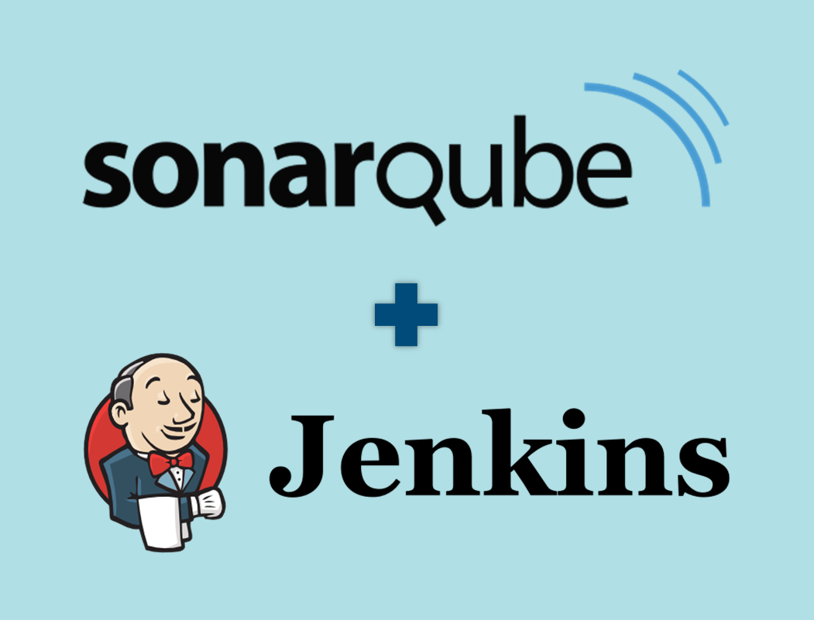

# JENKINS + SONARQUBE for WINDOWS

## Repositories & URLs
### Eviroment
You can configure as your desire changing .env file
### Urls
- *Jenkins* is configured to run in 9001 port. So, the URL will be <IPMachine>:9001, that is to say localhost:9001
- *SonarQube* is configured to run in 9001 port. So, the URL will be <IPMachine>:9001, that is to say localhost:9001
### Volumes
For data persistence, it has been linked with NFS volumes (Windows), which have been placed in *C:\docker_volumes*, if the folders do not exist, the boot process creates them.
## For windows lovers :-)
### Start up
To start, simply execute the *Up.bat* script of the root folder.
### Stop
To stop the component, simply execute the *down.bat* script of the root folder.
## First execution
- *Jenkins*: You must open the user password stored in the volume: docker_volumes\sonarJenkins\jenkins\secret.key
- *SonarQube* The default user is admin/admin
## References
- [Jenkins](https://hub.docker.com/_/jenkins)
- [SonarQube](https://hub.docker.com/_/sonarqube)
- [MySql](https://hub.docker.com/_/mysql)
